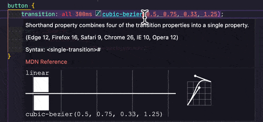

# VisuBezier

Provides a preview when hovering CSS easing functions in [VS Code](https://github.com/Microsoft/vscode).

## Features

Hover over any CSS easing function to get a preview of the animation, comparing it to a `linear` easing (default).

## Extension Settings

This extension has a few settings:

* `visubezier.defaulteasingfunction`: Override the default comparison easing function with any valid easing function expressed as a keyword or a `cubic-bezier()` function (default: `linear`).
* `visubezier.defaultduration`: Override the duration of the animation with any valid duration expressed as `0.5s` or `500ms` (default: `1s`).
* `visubezier.defaultbackground`: Override the background color for the preview area (default: `#2d2d30`).
* `visubezier.defaultcolor`: Override the foreground color for the preview elements (default: `#d7d7d7`).

## Known Issues

* `cubic-bezier` containing any values other than numbers are currently ignored (e.g. `calc()` or `var()`).
* Points with negative values can cause the animation to fall out of the preview area.

## Release Notes

### 1.1.1

Change the detection RegExp to be less greedy and not output false positives.

### 1.1.0

Add a preview of the Bézier curve next to the animation.

### 1.0.0

Initial release of VisuBezier. 🤘